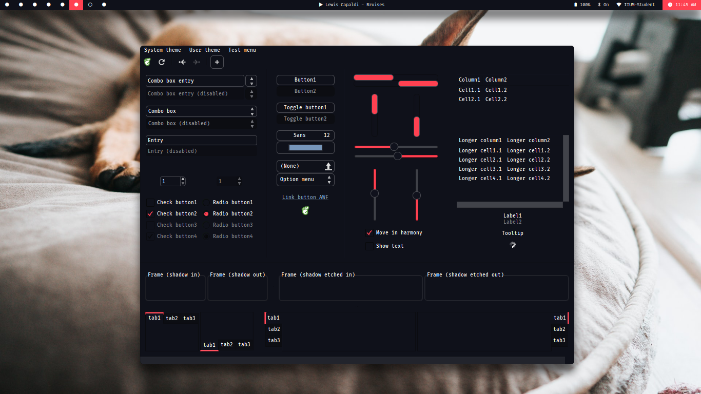
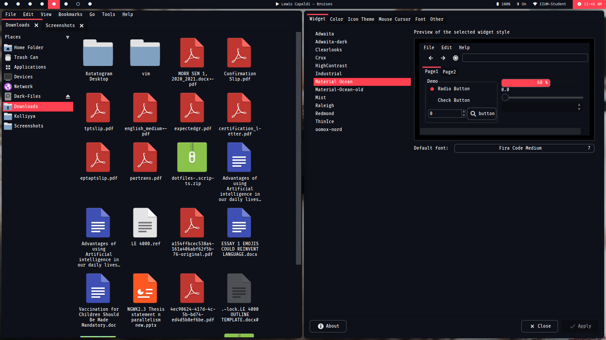
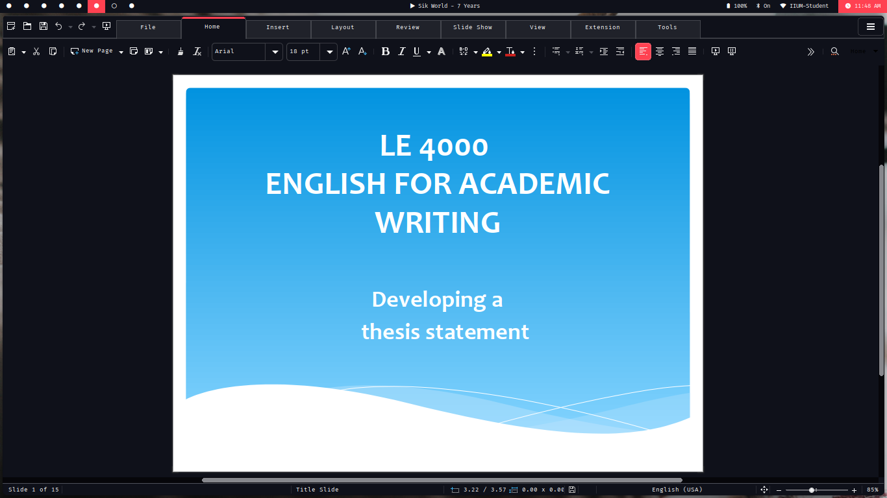

### Supported DE’s

- Gnome 3.x
- XFCE
- Unity
- Mate
- Budgie
- cinnamon
- Openbox
- Other Gnome based DE’s

### Installation

- Download or clone this repo to `~/.themes`

### Supplementaries

- [Icon theme]()

### Previews

Widgets

Applications

Libreoffice

### License

Licensed Under [GNU’s GPL version 3](https://github.com/material-ocean/Material-Ocean/blob/master/LICENSE)
